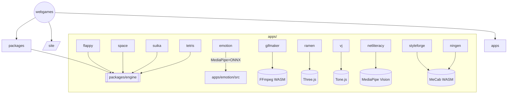
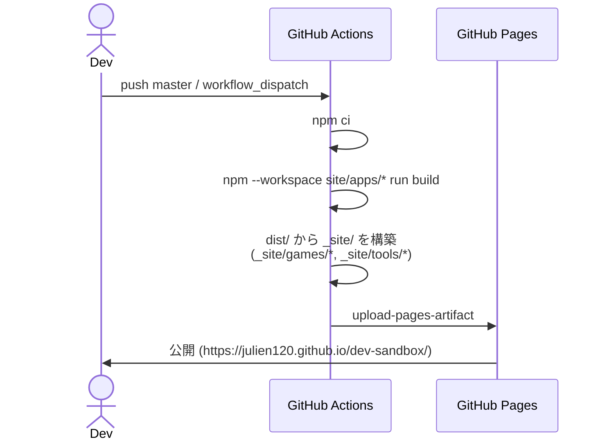

# Webgames Repository Guide

## リポジトリ概要

- **構成**: npm Workspaces を利用した monorepo。`apps/*` に各ゲーム／ツール、`packages/*` に共有ライブラリ、`site/` にポータルサイトを収録。
- **主要スタック**: TypeScript、Vite、Three.js / Tone.js（一部アプリ）、MediaPipe Tasks、FFmpeg WASM、MeCab WASM。
- **Node.js バージョン**: 20 系で検証済み（CI / deploy workflow も Node 20 を使用）。
- **ビルド成果物**: `dist/` 配下に各ワークスペースの出力をまとめ、GitHub Pages（`https://julien120.github.io/dev-sandbox/`）に配信。



## クイックスタート

1. 依存関係のインストール
   ```bash
   npm ci
   ```
2. 任意アプリの開発サーバーを起動
   ```bash
   npm --workspace apps/<name> run dev
   ```
   例: `apps/styleforge` は事前に MeCab アセットを同期するスクリプト（`predev`）が自動で走ります。
3. すべてのワークスペースをビルド
   ```bash
   npm run build
   ```
4. 静的解析・整形
   - Lint: `npm run lint`
   - フォーマット: `npm run format`
   - 型チェック: `npm run typecheck`

## ワークスペース一覧

| Workspace          | 種別           | base / 出力先                     | 主な役割                                                         | 特記事項                                                                                                |
| ------------------ | -------------- | --------------------------------- | ---------------------------------------------------------------- | ------------------------------------------------------------------------------------------------------- | --- | ---------------------- |
| `site`             | ポータル       | `/dev-sandbox/` → `dist/site`     | 各ゲーム／ツールへのランディングページ。                         | Vite 単体。新アプリ追加時は `site/src/catalog.json` を更新すればカードと Pages コピー対象が同時に反映。 |
| `packages/engine`  | 共有ライブラリ | ESM パッケージ                    | ゲームループ (`ticker.ts`)、シーン管理、入力、衝突判定等を提供。 | `@webgames/engine` としてローカル参照。                                                                 |
| `apps/flappy`      | ゲーム         | `/dev-sandbox/games/flappy/`      | フラッピーバード系。`@webgames/engine` 依存。                    | 追加アセットなし。                                                                                      |
| `apps/space`       | ゲーム         | `/dev-sandbox/games/space/`       | 縦スクロールシューティング。                                     | 追加アセットなし。                                                                                      |
| `apps/suika`       | ゲーム         | `/dev-sandbox/games/suika/`       | 合体パズル（スイカゲーム）。                                     | 追加アセットなし。                                                                                      |
| `apps/tetris`      | ゲーム         | `/dev-sandbox/games/tetris/`      | テトリス実装。                                                   | CI では `npm --workspace apps/tetris run build                                                          |     | true` として失敗許容。 |
| `apps/emotion`     | ツール         | `/dev-sandbox/games/emotion/`     | Web カメラ＋表情推定のミニゲーム。                               | MediaPipe と ONNX Runtime のアセット同期が必要。                                                        |
| `apps/gifmaker`    | ツール         | `/dev-sandbox/tools/gifmaker/`    | ブラウザだけで GIF 生成。                                        | FFmpeg WASM の worker / wasm / data を `public/ffmpeg` にコピー。                                       |
| `apps/ramen`       | ツール         | `/dev-sandbox/tools/ramen/`       | 3D ラーメンモデル閲覧。                                          | `sync-assets.mjs` でプレースホルダーアセットを配置。                                                    |
| `apps/vj`          | ツール         | `/dev-sandbox/tools/vj/`          | Tone.js × Three.js のインタラクティブ VJ ツール。                | 同上。                                                                                                  |
| `apps/netliteracy` | ツール         | `/dev-sandbox/tools/netliteracy/` | 顔検出＆ぼかし。                                                 | MediaPipe Face Detector / Landmarker 資産を同期。                                                       |
| `apps/styleforge`  | ツール         | `/dev-sandbox/tools/styleforge/`  | MeCab を用いた文体変換＆解析ツール。                             | `sync-assets.mjs` が `libmecab.wasm/.data` を `public/mecab/` に同期。辞書ファイルは約 53 MB と大きめ。 |
| `apps/ningen`      | ツール         | `/dev-sandbox/tools/ningen/`      | 『人間失格』の頻出語を可視化するワードクラウドラボ。             | `public/corpus/ningen.txt` を参照し、`sync-assets.mjs` で MeCab WASM を同期。                           |
| `apps/silhouette`  | ツール         | `/dev-sandbox/tools/silhouette/`  | 人物シルエットと縦書き文字を重ねたビジュアル生成ツール。         | MediaPipe Selfie Segmenter の WASM／モデルを `public/mediapipe/` へ同期。                               |
| `apps/DVD`         | ツール         | `/dev-sandbox/tools/DVD/`         | Web カメラで身体を検出して遊ぶ DVD Dodge 体感アクション。        | Pose Landmarker の WASM／モデルを `public/mediapipe/` へ同期するスクリプトを実装。                     |
| `apps/bubbles`     | ツール         | `/dev-sandbox/tools/bubbles/`     | Google スプレッドシート A 列のテキストがシャンボン玉のように浮遊。| シートID/シート名を env or クエリで設定。公開シート（GViz API）が必要。                                |

## アセット同期スクリプト

| アプリ      | 同期コマンド                             | 同期対象                                               | 備考                                                        |
| ----------- | ---------------------------------------- | ------------------------------------------------------ | ----------------------------------------------------------- |
| emotion     | `node scripts/sync-mediapipe-assets.mjs` | MediaPipe Face Landmarker / WebAssembly & ONNX Runtime | カメラ推論に必要。                                          |
| gifmaker    | `node scripts/sync-ffmpeg-core.mjs`      | `@ffmpeg/core` の worker / wasm / data                 | ブラウザ上で FFmpeg を動かすため。                          |
| ramen / vj  | `node scripts/sync-assets.mjs`           | プレースホルダーの 3D アセット                         | 将来差し替え前提。                                          |
| netliteracy | `node scripts/sync-assets.mjs`           | MediaPipe Face Detector / Landmarker モデル＆WASM      | `.tflite` / `.task` を `public/mediapipe/` へ展開。         |
| styleforge  | `node scripts/sync-assets.mjs`           | MeCab WASM (`libmecab.wasm/.data`)                     | `public/mecab/` に同期、dev/build 前に自動実行。            |
| ningen      | `node scripts/sync-assets.mjs`           | MeCab WASM (`libmecab.wasm/.data`)                     | `public/mecab/` に同期、`public/corpus/ningen.txt` を参照。 |
| silhouette  | `node scripts/sync-assets.mjs`           | MediaPipe Selfie Segmenter WASM／モデル                | `public/mediapipe/` に展開し、predev/prebuild で自動同期。  |
| DVD         | `node scripts/sync-mediapipe-assets.mjs` | Pose Landmarker の WASM／`.task` モデル                | カメラベース操作用のポーズ検出をブラウザ内で提供。          |

これらのスクリプトは `predev` / `prebuild` で連携済み。新しい外部アセットを追加する際は同様の仕組みを採用すると安全です。

## デプロイフロー

GitHub Actions (`.github/workflows/deploy.yml`) で Pages へ配信します。



- すべての Vite プロジェクトで `base` と `build.outDir` を `/dev-sandbox/...` に揃えているため、GitHub Pages のネストにも対応。
- 各アプリ出力は `_site/games/<name>` または `_site/tools/<name>` に整理されます。新アプリを追加した際はワークフロー内のコピー処理を更新することを忘れないでください。

## 開発ガイドライン（抜粋）

- **アクセシビリティ**: 入力デバイスはキーボード／タッチ両対応、Tab ナビゲーションや `aria-*` を考慮（`CODEX.md` を参照）。
- **パフォーマンス**: GC 抑制・矩形＆円の簡易当たり判定など軽量化が既定。`packages/engine` を活用して重複実装を避ける。
- **Vite 設定**: すべて `base: '/dev-sandbox/.../'` を設定済み。ローカルで別ポートにデプロイする場合は環境に合わせて `vite.config.ts` を調整。
- **大容量アセット**: Styleforge の MeCab 辞書（約 53MB）や Emotion の MediaPipe／ONNX は初回ロードが重いので、端末への案内やプログレス表示を検討すると UX が向上。
- **HTTPS 要件**: MediaPipe など一部 API は HTTPS でのみ動作。ローカル確認時は `vite --host` と自己署名・Cloudflare Tunnel 等を組み合わせると実機検証しやすい。

## 参考リソース

- `CODEX.md`: 作業ルール（文体・PR テンプレ・ゲームごとの要件など）。
- `ARCHITECTURE.md`: 初期設計メモ。document.md と合わせて参照すると全体像を把握しやすい。
- `CONTRIBUTING.md`: コントリビュートポリシー（スタイル・コミット方針など）。

---

この `document.md` は、リポジトリの全体像を把握しやすくするためのサマリです。新しいアプリや共有モジュールを追加する際は、同様の観点（構成、同期スクリプト、デプロイ反映手順）を追記して整合性を保ってください。

## プロンプト

- このリポジトリの作業したコードを整理して、余計な部分を取り覗き、とても分かりやすくドキュメント化してください。document.mdを作成したらそこに記述して、githubで閲覧するのでマークダウンでマーメイドや図形も使えます。
